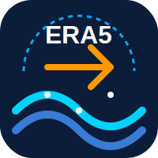

<table>

<tr>

<td>



</td>

<td>

CoastERA Toolkit: Advanced MetOcean Data Integrator

</td>

</tr>

</table>

CoastERA Toolkit is a professional engineering tool designed specifically for Coastal and Hydrodynamic modelers. It provides a seamless GUI integration with the Copernicus Climate Data Store (CDS) API to automatically extract, process, and format ERA5 hourly time-series data (1940 - Present) for offshore boundary conditions.

The tool bridges the gap between raw meteorological NetCDF datasets and ready-to-use coastal engineering inputs (e.g., SWAN, Delft3D, MIKE), overcoming traditional challenges of data wrangling, vector derivations, and formatting.

<p align="center">


</p>

🔬 Engineering Methodology

The toolkit follows a systematic 4-phase workflow tailored for coastal engineering applications:

Phase 1: Automated Offshore Retrieval

Connects to the Copernicus CDS API to download massive historical archives.

Spatial Targeting: Automatically finds the nearest offshore data node based on user-defined decimal coordinates and bounding box padding.

Temporal Resolution: Supports Hourly, 3-hour, 6-hour, and 12-hour resolution.

Phase 2: Feature Engineering \& Vector Conversion

Transforms raw atmospheric variables into standard coastal engineering parameters.

Wind Derivation: Automatically calculates Absolute Wind Speed and Meteorological Wind Direction (True North, coming from) using 10m U and V components.

Parameter Standardization: Renames complex Copernicus NetCDF variables to standard notations

Phase 3: Visual Analytics \& Rose Generation

Provides immediate graphical insights into local wave and wind climates.

Directional Roses: Generates highly detailed Wave and Wind Roses highlighting intensity, frequency, and fetch directions using meteorological conventions.

Time-Series Plotting: Plots dynamic temporal variations for extreme event analysis.

Phase 4: Hydrodynamic Boundary Generation

TPAR Files: Automatically generates ready-to-use .tpar files for direct boundary condition ingestion into Delft3D and SWAN numerical models.

Data Extraction: Compiles all selected variables into a cleaned .csv file with metadata headers.

🌊 Supported Variables (Single Levels)

Wave Parameters: Significant height (

H

s

H 

s

​

&#x20;

&#x20;Combined, Wind, Swell), Peak wave period (

T

p

T 

p

​

&#x20;

), Mean wave periods (

T

m

T 

m

​

&#x20;

), and Mean wave directions.

Wind Parameters: 10m U-component, 10m V-component, Drag coefficient with waves.

Thermodynamics \& Pressure: Sea Surface Temperature (SST), Mean Sea Level Pressure (MSLP), 2m Temperature.

📊 Automated Outputs

Time-Series Data: wave\_data.csv

Engineering Graphs: wave\_rose.png, wind\_rose.png, and wave\_wind\_timeseries.png.

Model Inputs: boundary\_conditions.tpar (Delft3D / SWAN).

🛠️ Installation \& Dependencies

### 1. Install Python Dependencies
Open OSGeo4W Shell (as Administrator) or your local terminal and run:

```bash
python -m pip install "numpy<2.0.0" cdsapi xarray pandas matplotlib windrose netCDF4 scipy
```
*(Alternatively, you can install the dependencies listed in `requirements.txt` using `pip install -r requirements.txt`)*

### 2. Install QGIS Plugin
1. Open QGIS (version 3.40 or above is recommended).
2. Navigate to **Settings > User Profiles > Open Active Profile Folder**.
3. Go into `python/plugins/`.
4. Copy this entire folder (e.g., `CoastERA`) into the `plugins` directory.
5. Restart QGIS, open **Plugins > Manage and Install Plugins...**, find **CoastERA Toolkit** under the "Installed" tab, and check the box to enable it.
6. Open the **Processing Toolbox** panel (Processing > Toolbox). You will find a new group called **CoastERA Toolkit** -> **MetOcean Data**.
7. Double click **Download & Process ERA5 Data** to launch the native interface!

*(Note: You must have a registered account on the Copernicus Climate Data Store and obtain an API key via the .cdsapirc file, which the GUI handles automatically).*

📧 Contact \& Citation

Author: Mohamed Aly Nasef

Email: Eng.m.nasef2017@gmail.com, Nasefm.aly@alexu.edu.eg

Citation: 

🤖 AI Acknowledgment

The development of the CoastERA Toolkit code, logical structure, NetCDF processing pipelines, and technical documentation were significantly enhanced and optimized using Google Gemini. The AI assisted in debugging complex Tkinter GUI workflows and ensuring best practices in data science and coastal engineering processing.
