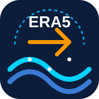
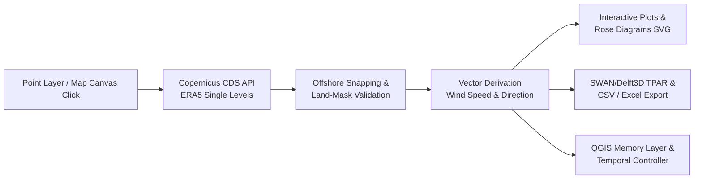

<table>
  <tr>
    <td></td>
    <td><h1>CoastERA Toolkit: Advanced MetOcean Data Integrator</h1></td>
  </tr>
</table>

**CoastERA Toolkit** is a professional engineering tool designed specifically for coastal engineers and hydrodynamic modelers. It provides a seamless native QGIS Processing integration with the Copernicus Climate Data Store (CDS) API to automatically extract, process, quality-check, and format ERA5 hourly time-series data (1940 – Present) for offshore boundary conditions.

The tool bridges the gap between raw meteorological NetCDF datasets and ready-to-use coastal engineering inputs (e.g., **SWAN**, **Delft3D**, **MIKE**), eliminating traditional data-wrangling hurdles, vector conversions, and formatting overhead.


```mermaid
graph LR
    A[Point Layer / Map Canvas Click] --> B[Copernicus CDS API<br/>ERA5 Single Levels]
    B --> C[Offshore Snapping &<br/>Land-Mask Validation]
    C --> D[Vector Derivation<br/>Wind Speed & Direction]
    D --> E[Interactive Plots &<br/>Rose Diagrams SVG]
    D --> F[SWAN/Delft3D TPAR &<br/>CSV / Excel Export]
    D --> G[QGIS Memory Layer &<br/>Temporal Controller]
```

---

## 🔬 Engineering Methodology

The toolkit follows a systematic 4-phase workflow tailored for coastal engineering applications:

### Phase 1: Automated Offshore Retrieval & Land-Mask Check
- **Copernicus CDS API:** Connects directly to Copernicus CDS to extract historical and near-real-time atmospheric and wave reanalysis.
- **Offshore Snapping:** Automatically detects whether a requested coordinate falls on the ERA5 land mask (where wave variables are undefined) and snaps to the nearest offshore data node within the user-defined padding area.
- **Temporal Resolution:** Supports 1-hour, 3-hour, 6-hour, and 12-hour sampling.

### Phase 2: Feature Engineering & Vector Conversion
- **Wind Speed & Direction:** Calculates absolute wind speed and meteorological direction ("coming from", clockwise from True North) using the 10m $U$ and $V$ vector components:
  $$\text{WSpd} = \sqrt{U_{10}^2 + V_{10}^2}$$
  $$\text{WDir} = \left(270^\circ - \text{atan2}(V_{10}, U_{10})\right) \pmod{360^\circ}$$
- **Parameter Standardization:** Automatically harmonizes Copernicus NetCDF nomenclature into standard coastal engineering notation ($H_s$, $T_p$, $T_m$, $\text{Dir}$, etc.).

### Phase 3: Visual Analytics & Directional Roses
- **Directional Roses:** Generates publication-ready wave and wind roses with dynamic binning and exact legends in vector format (`.svg`).
- **Interactive Timeseries:** Produces multi-variable synchronized interactive plots (`.html`) powered by Plotly for detailed extreme event analysis.
- **Map Canvas Symbology:** Automatically styles points with the generated SVG roses or meteorological direction arrows.

### Phase 4: Hydrodynamic Boundary Generation
- **Delft3D / SWAN TPAR Files:** Produces verified `.tpar` boundary condition files with standard column formatting, directional spreading ($20.0^\circ$), and automatic missing-value validation.
- **Cleaned Data Exports:** Exports complete time-series tables to both `.csv` and `.xlsx` formats with prepended point coordinates.
- **QGIS Temporal Controller:** Memory vector layers are fully integrated with the native QGIS Temporal Controller for interactive time-step animation.

---

## 🌊 Supported Variables (Single Levels)

- **Wave Parameters:** Significant wave height ($H_s$ Combined, Wind-wave, Total Swell), Peak wave period ($T_p$), Mean wave period ($T_m$), and Mean wave directions.
- **Wind Parameters:** 10m U-component ($U_{10}$), 10m V-component ($V_{10}$), Drag coefficient with waves ($C_d$).
- **Thermodynamics & Pressure:** Sea Surface Temperature (SST), Mean Sea Level Pressure (MSLP), 2m Temperature ($T_{2m}$).

---

## 📊 Automated Outputs

For each selected offshore point, CoastERA generates:
- **Time-Series Data:** `wave_data_{point_label}_{lat}_{lon}.csv` and `.xlsx`
- **Engineering Graphics:** `waverose_{point_label}_{lat}_{lon}.svg` and `windrose_{point_label}_{lat}_{lon}.svg`
- **Interactive Graphs:** `timeseries_{point_label}_{lat}_{lon}.html`
- **Numerical Model Boundary Files:** `boundary_{point_label}_{lat}_{lon}.tpar` (Delft3D / SWAN compatible)
- **QGIS Vector Layer:** Memory point layer loaded into the active QGIS project, pre-labeled with max $H_s$ statistics and linked to QGIS Temporal Controller.

---

## 🛠️ Installation & Dependencies

### 1. Install Python Dependencies

Open the **OSGeo4W Shell** (as Administrator on Windows) or your active Python environment and run:

```bash
python -m pip install numpy cdsapi xarray pandas matplotlib plotly netCDF4 scipy openpyxl
```

*(Alternatively: `pip install -r requirements.txt`)*

### 2. Install the QGIS Plugin

1. Open QGIS (compatible with **QGIS 3.22+** and **QGIS 4.0**).
2. Navigate to **Settings > User Profiles > Open Active Profile Folder**.
3. Open `python/plugins/`.
4. Place the `coastERA_Toolkit` folder into the `plugins` directory.
5. Restart QGIS, open **Plugins > Manage and Install Plugins...**, locate **CoastERA Toolkit** under the "Installed" tab, and check the box to enable it.
6. Open the **Processing Toolbox** (Processing > Toolbox). Under **CoastERA Toolkit > MetOcean Data**, double-click **Download & Process ERA5 Data** to launch.

> **Note on CDS API Keys:** You must have a free registered account on the Copernicus Climate Data Store and configure your credentials via `.cdsapirc` or enter your API URL and Key directly in the algorithm dialog.

---

## 📧 Contact & Citation

- **Author:** Mohamed Aly Nasef
- **Email:** Eng.m.nasef2017@gmail.com, Nasefm.aly@alexu.edu.eg
- **Citation:** Nasef M. Aly. (2026). *Nasef2017/coastERA-Toolkit: coastERA-Toolkit (v1.2.1)*. Zenodo. https://doi.org/10.5281/zenodo.19884109

---

## 🤖 AI Acknowledgment

The development of the CoastERA Toolkit code, QGIS Processing algorithm architecture, NetCDF processing pipelines, and technical documentation was optimized and verified using Google Gemini.
